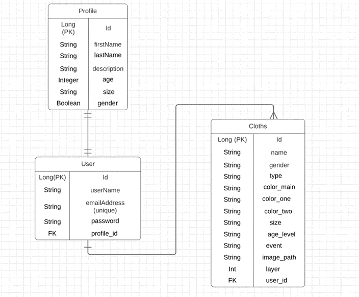
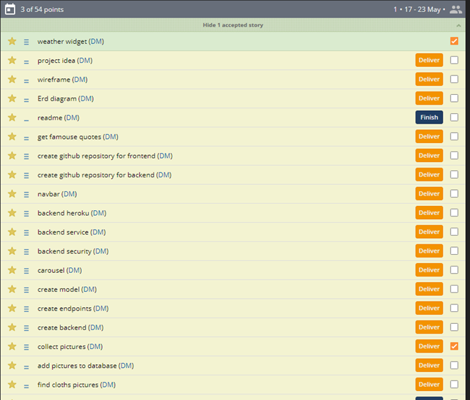
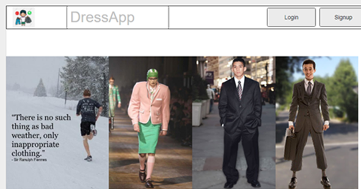
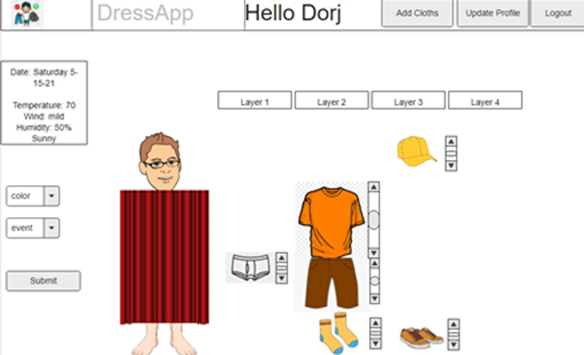
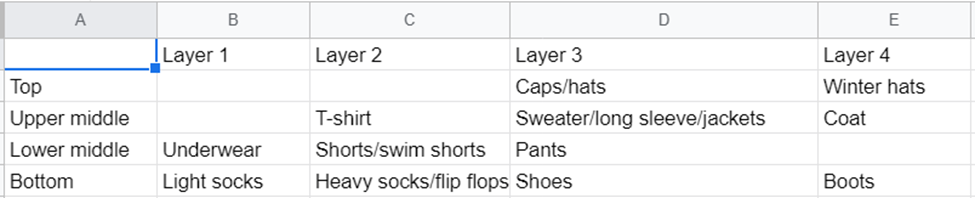
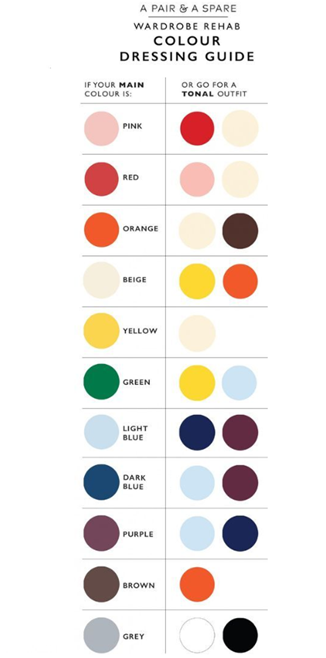
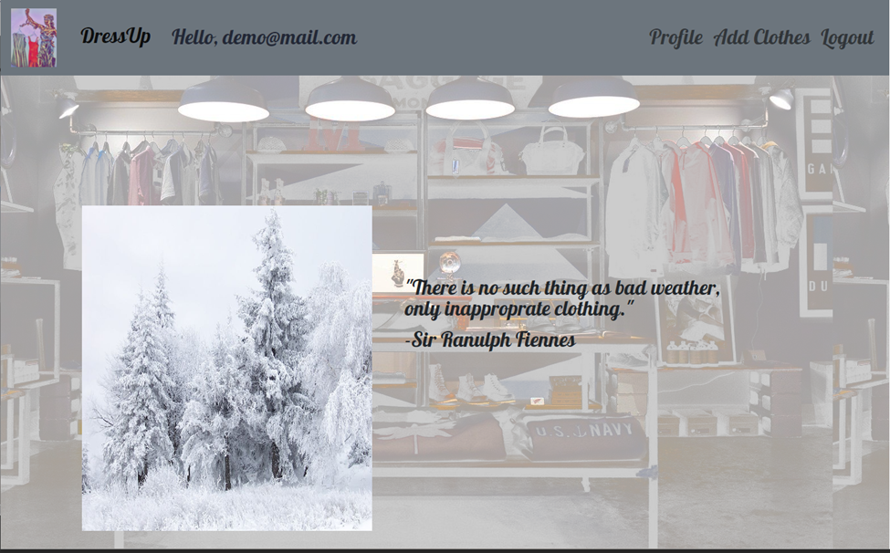
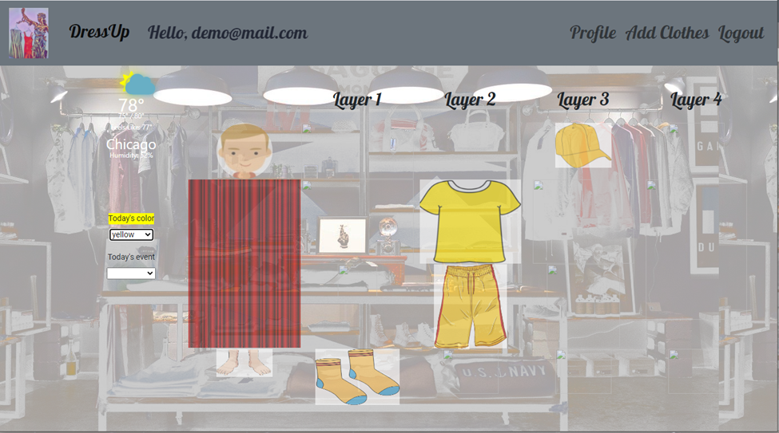

# User Stories
Primary users are individuals who wants to better manage their clothing depending on the weather or occasion. It can be used as an app on a smart mirror or any device with a browser.

User stories:
1. A user wants to dress appropriately according to the current weather condition
2. A user wants to dress appropriately having color matched be between clothes they are wearing
3. A user wants to dress according to current event such as Halloween, Christmas, and St Patricks’ day. 
4. A user wants to access their clothing app from anywhere
5. A user wants their information secure and inaccessible to the public.
6. A user wants to have separate accounts from other members of their family

# Approach
1.	Brainstormed ideas
2.	Used wireframe to sketch an outline
3.	Designed a database structure
4.	Planned details of the project flow using pivotaltracker
5.	Created Backend app using ERD diagram with Spring Boot

    a.	Initialized project
    b.	Created Models, endpoints, and services
    c.	Secured backend using JWT
    d.	Tested all endpoints using Postman
    e.	Deployed to Heroku
6.	Created Frontend app following the wireframe design

    a.	Initialized project on Angular
    b.	Started working on landing page
    c.	Created navigation bar, profile, and login
    d.	Started working on main page creating required components
    e.	Collected pictures and created clothing entries in the database
    f.	Finished logic of clothes selection
    g.	Deployed to Heroku

# Planning
ERD design of model which demonstrates how the entities of the Clothing API relate to one
another. This is an overview of the database showing the relationships between the profile, 
user, and clothing tables. 

Pivotaltracker was used to plan the workflow and track the progress of the project. 

### Wireframe design
Inital design idea using wireframe. The interface helped visualize what would need to be done
to complete the project. 

### Organization of clothing

Organization of clothing is based on the layer and location on the body. 

Four layers were used: 
1. Layer 1 is the internal clothing 
   
1. Layer 2 is lighter external clothing

1. Layer 3 is heavier external clothing 
   
1. Layer 4 consists of outerwear

### Color selection
This color scheme was used to determine the colors that would pair well together for the
clothing.

**Final Product**
Landing page contains a navigation bar and image carousel. From there, the user can login
or create a new account. Once the user is logged in, they can edit their profile and add
clothes to the database. This app can be used for clothing inspiration, based off of the 
weather, color, and event for the day. 

## API Endpoints
| http method |Endpoint |Functionality| Access| 
| ------ | ------ | ------ | ------ 
|POST| /auth/users/register  |  Create a user | Public  |
|POST| /auth/users/login |  User login to generate JWT Token | Public  |
|POST| /api/profile  |  Create user Profile| Private  |
|GET| /api/profile  |  Get user Profile| Private  |
|PUT| /api/profile|Updates a user profile|Private |
|GET| /api/clothes  |  Get all clothes of the user | Private  |
|GET|  /api/clothes/{id}  |  Gets a single cloth | Private
|POST| /api/clothes|Creates a new cloth|Private |
|PUT| /api/clothes/{id}|Updates a cloth with the supplied id |Private |
|DELETE| /api/clothes/{id}|Delete a cloth with the supplied id |Private 

## How to run App
1. Go to the following link to access app: 
   * frontend https://dressfront.herokuapp.com
   * frontend source https://github.com/mdorjbat/dressfront
   * backend  https://secret-savannah-30262.herokuapp.com/
   * backend source https://github.com/mdorjbat/dressapp
   
1. Register new user
1. Login to the app

## Tools used
* Spring Boot Framework
* IntelliJ IDEA/Java 11
* Angular
* Heroku 
  
* Git
* Tomcat Server
* Apache Maven
* Dev Profile
* Postman
* Postgresql
* pgAdmin 4 
  
* Openweather.org
* MSPaint
* Word
* Excel
* Weather gadget
* Lucid app (ERD) diagram
* https://app.moqups.com/

## Challenges

Figuring out the formating of CSS was challenging. There were many variables that 
needed to be taken into consideration and adjust, pictures would appear in random spots and finding
the right orientation for the elements was time-consuming.  In order to overcome this challenge
I used the CSS grid and was able to place the elements in their correct locations.

## Personal Experience
Creating this app  was a great experience. It allowed me to practice backend and 
frontend utilizing Angular and Spring Boot in order apply what I had learned from the course. 
Learning ways to develop the project was rewarding seeing the wireframe become a real application
in the final product and watching my idea materialize. 

## Future Plans
* Add a feature that allows users to analyze their clothing
* Add a feature that allows clothing to easily be added to the database
* More testing for backend 
* Add more subcategories 
* Make the interface mobile device friendly
* Add shopping feature
* Include more diverse option for character customization
